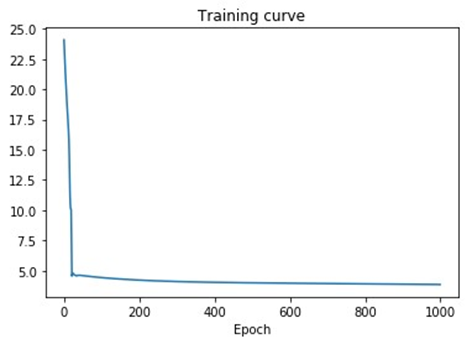
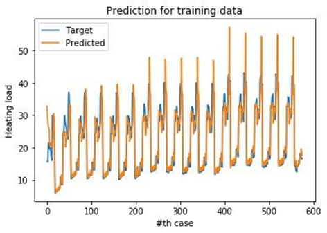
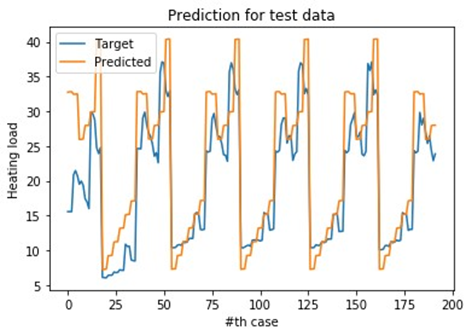

# DNN implementation from scratch using NumPy
My implementation of DNN (Deep Neural Network) from scratch using NumPy for regression task. Implemented using linear activation function, with MSE loss function, RMSE accuracy metric, and optimized by SGD (Stochastic Gradient Descent). This is from my first homework of Deep Learning course in my university (NCTU) taught by Prof Lee-Chia Han. There are two task in this homework, first is to implement regression and second is classification. However, at that time I can only implement the regression one (in this repository).

## Libraries you will need
The following are Python libraries you will need (and the version I am currently using):
- NumPy (v1.17.4)
- Matplotlib (v3.0.3)

## Changelog
- 2020/08/18 First commit of files and modification of DNN.py to be slightly faster (see commit #1369276).

## Dataset Source
The dataset we will use in this example is Energy Efficiency Dataset that can be downloaded [here](https://archive.ics.uci.edu/ml/datasets/Energy+efficiency) from UCI Machine Learning Repository. Please put the CSV dataset in `dataset/` folder.

## How to run the Code
Clone or download this repository and run `DNN.py`.

## To do
I am planning to modify the code that can take another type of dataset and implement another activation function.

## Result
This is the old result that I have (for more details please see `results/DL_HW1_report.pdf`).  
  
  
  
